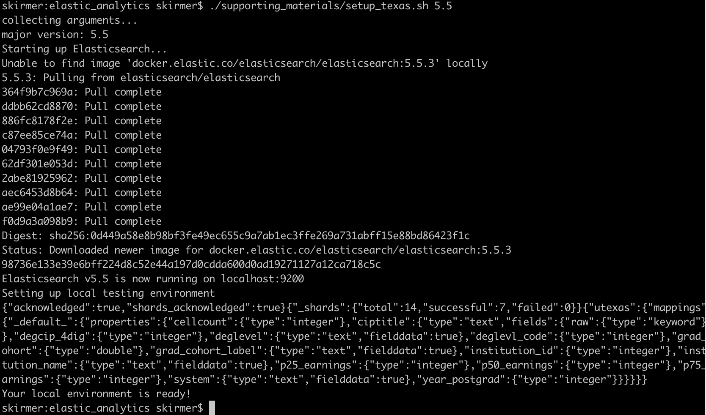
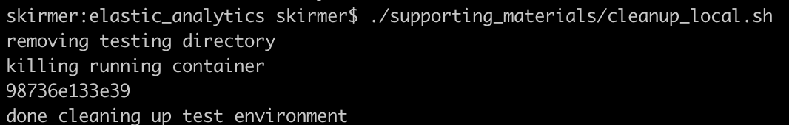

# Integrating Elasticsearch with Analytics Workflows  
## Advance Instructions  

### Stephanie Kirmer, ODSC West 2019  

Before the session, users should:

1. Download and install Docker. This requires visiting hub.docker.com, creating a user account, and downloading the free personal use software that is correct for your operating system. You’re welcome to do the accompanying tutorial but it is not necessary for this training.  
2. Clone the github repository: https://github.com/skirmer/elastic_analytics  
3a. If you use R, download the libraries elastic and uptasticsearch. (CRAN)  
3b. If you use Python, download the libraries elasticsearch-py and uptasticsearch. (PYPI)  

4. Test that your system is correctly set up:  

To confirm that your installation is working, AND to check that Elasticsearch is downloaded to your system ahead of time, follow these steps (also found on the github readme).

*After cloning this repo, if you have Docker installed and running, you can spin up your own Elasticsearch database on your local machine. Move into the top level of this repository after you clone it, and run the following at command line:*  

`./supporting_materials/setup_texas.sh 5.5`

*You should see a screen similar to the following when this is operating correctly:*

*When the terminal indicates that the processes are complete, close down the database with this command:* 
`./supporting_materials/cleanup_local.sh`

*If this has completed successfully, your screen should look similar to this.*

**There is NO need to run any other code ahead of time. Any questions before the session can be directed to me on Twitter @data_stephanie - I look forward to seeing you in October!**

